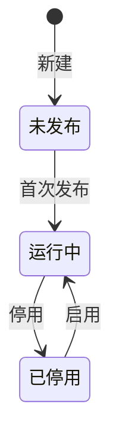
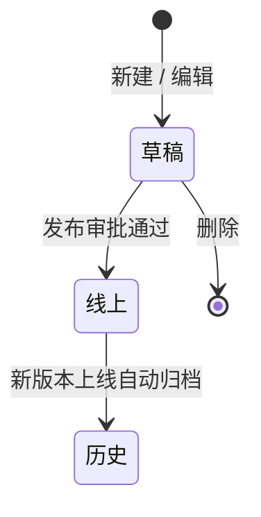

# 历史版本 - 状态流转

## 两张表

| 表 | 职责 | 状态 |
|---|---|---|
| **主表** | 实体运行状态 | 未发布 / 运行中 / 已停用 |
| **历史表** | 版本生命周期 | 草稿 / 线上 / 历史 |

## 主表状态

## 历史表状态

约束：草稿最多 1 个，线上最多 1 个，历史不限。

## 编辑逻辑

有草稿 → 打开继续编辑；没有 → 复制线上版本生成新草稿。始终只维护一份草稿。

## 版本顺序

草稿一定是最新版本，线上一定是第二新版本。

原因：草稿只能基于线上版本复制产生，所以草稿 version 一定 > 线上 version。而线上版本上线时会把更早的线上归档为历史，所以线上永远是仅次于草稿的第二新。

## 列表页启用/禁用

列表页的「启用」「禁用」操作本质是：新增或编辑一个草稿，将草稿中的启用状态字段改掉。仍需走发布流程才能生效到线上。
